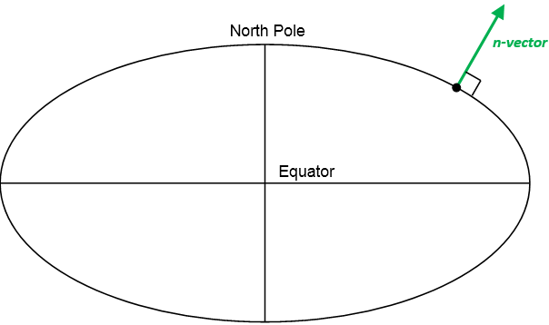
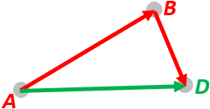

.. _nvector:

========
N-vector
========

Introduction
############

Performing global position calculations often involves one or more of the 
following concerns:

  1. Complex implementations (many, and often complex lines of program code needed)
  2. Approximations, e.g.
     a. distortion in map projections
     b. assuming spherical Earth when ellipsoidal should be used
        Errors often increase with increasing distances
  3. Equation/code not valid/accurate for all Earth positions, e.g.
     a. Latitude/longitude:
       i.  Singularities at Poles
       ii. Discontinuity at International Date Line (:math:`\pm 180^\circ` meridian)
     b. Map projections: usually valid for a limited area, e.g. UTM
  4. Iterations (need to iterate to achieve needed accuracy)

By using the solutions provided here, these concerns can be avoided for a 
majority of position calculations.

What can go wrong if using latitude and longitude?
Even the simple discontinuity of longitude at the International Date Line 
(:math:`\pm 180^\circ` meridian) can give serious consequences if not handled 
correctly in all the code. An example illustrating this was the computer 
crash experienced by 12 fighter aircrafts (F-22 Raptors) when they crossed 
this meridian in 2007.

The discontinuity can be quite easily handled by adding specific code, while 
the singularities at the Poles are much more challenging to deal with. 
Examples of how the singularities can affect calculations with latitude and 
longitude are found in Section 6 of the reference Gade (2010).

As discussed above, using latitude and longitude in calculations may lead to 
several problems due to the singularities at the Poles and complex behavior 
near the Poles, and due to the discontinuity at the Date Line (:math:`\pm 180^\circ` meridian).

Instead of latitude and longitude, we represent position with an “n-vector”, 
which is the normal vector to the Earth model (the same reference ellipsoid 
that is used for latitude and longitude). When using n-vector, all Earth-positions 
are treated equally, and there is no need to worry about singularities or 
discontinuities. An additional benefit with using n-vector is that many position 
calculations can be solved with simple vector algebra (e.g. dot product and cross product).

The n-vector is the normal vector to the Earth model (reference ellipsoid).

Converting between n-vector and latitude/longitude is done with the simple 
equations (3) to (5) in Gade (2010). Those equations are implemented in two 
of the files available for download here. Going from latitude and longitude 
to n-vector is done with the function lat_long2n_E, while n_E2lat_long does 
the opposite conversion.  n_E is n-vector in the program code, while in 
documents we use :math:`\mathbf{n}^{\mathbf{E}}`. E denotes an Earth-fixed 
coordinate frame, and it indicates that the three components of n-vector are 
along the three axes of E. More details about the notation used are found here. 
The position of the North Pole given as n-vector is

.. math::
    \mathbf{n}^{E} = \begin{bmatrix}
            0 \\
            0 \\
            1 \\
            \end{bmatrix}

(assuming the coordinate frame E has its z-axis pointing to the North Pole). 
For all the details about n-vector, see the reference Gade (2010).

Many position calculations can be solved with only two functions
################################################################
It turns out that very often, the problem to be solved is one of these:

  1. **A and B => delta:** Given two positions, A and B (e.g. as latitudes/longitudes/heights), 
     find the (delta) vector from A to B in meters. See also Example 1.
  2. **A and delta => B:** Given position A (e.g. as lat/long/height) and a vector in meters 
     from A to B, find position B. See also Example 2.

Two functions performing these calculations are available here, using n-vectors for 
position A and B as input/output. The n-vectors for position A and B are written 
:math:`\mathbf{n}_{EA}^{E}` and :math:`\mathbf{n}_{EB}^{E}`
while in program code we use n_EA_E and n_EB_E. The (delta) position 
vector from A to B is written :math:`\mathbf{p}_{AB}^{E}` (p_AB_E). 
More info about the notation is found in the next section.

Based on the above variable names, the two above functions are called:

  1.  n_EA_E_and_n_EB_E2p_AB_E
  2.  n_EA_E_and_p_AB_E2n_EB_E

Mathematical notation used
##########################
The notation system used for the n-vector library is presented in 
Chapter 2 of the following thesis: Gade (2018): "Inertial Navigation - Theory and Applications". 
A simplified presentation is given here.

Coordinate frame
----------------
A coordinate frame has a position (origin), and three axes (basis vectors) x, y and z (orthonormal). 
Thus a coordinate frame can represent both position and orientation, i.e. 6 degrees of freedom. 
It can be used to represent a rigid body, such as a vehicle or the Earth, and it can also be 
used to represent a "virtual" coordinate frame such as North-East-Down.

Coordinate frames are designated with capital letters, e.g. the three generic coordinate frames A, B, and C.

We also have specific names for some common coordinate frames:

==================== ======================
**Coordinate frame** **Description**
*E*                  Earth
*N*                  North-East-Down
*B*                  Body, i.e. the vehicle
==================== ======================
 

General vector
--------------
A 3D vector given with numbers is written e.g. 
:math:`\begin{bmatrix} 2 \\ 4 \\ 6 \\ \end{bmatrix}`. 
The three numbers are the vector components 
along the x, y and z axes of a coordinate frame. If the name of the vector is k, and the 
coordinate frame is A, we will use bold k and A as trailing superscript, i.e.:

.. math::

    \mathbf{k}^{\mathbf{A}} = \begin{bmatrix}
                            2 \\
                            4 \\
                            6 \\
                            \end{bmatrix}

Thus :math:`\mathbf{k}^{\mathbf{A}}` is the 3D vector that is constructed by going 
2 units along the x-axis of coordinate frame A, 4 units along the y-axis, and 6 along 
the z-axis. We say that the vector k is decomposed in A.

Position vector
---------------
Instead of the general vector k, we can have a specific vector that goes from A to B. 
This vector can be decomposed in C. A, B, and C are three arbitrary coordinate frames. 
We would write this vector:

.. math::
    \mathbf{p}_{\mathbf{AB}}^{\mathbf{C}}

In program code: p_AB_C

The letter p is used since this is a position vector (the position of B relative to A, 
decomosed/resolved in the axes of C).

**Example a):**

.. math::

    \mathbf{p}_{\mathbf{EB}}^{\mathbf{E}} = \begin{bmatrix}
            0 \\
            0 \\
            6371 \\
            \end{bmatrix} km

From the subscript we see that this is the vector that goes from E (center of the Earth) 
to B (the vehicle). The superscript tells us that it is decomposed in E, which we now 
assume has its z-axis pointing towards the North Pole. From the values we see that the 
vector goes 6371 km towards the North Pole, and zero in the x and y directions. If we 
assume that the Earth is a sphere with radius 6371 km, we see that B is at the North Pole.

**Example b):**

.. math::

    \mathbf{p}_{\mathbf{BC}}^{\mathbf{N}} = \begin{bmatrix}
            50 \\
            60 \\
            -5 \\
            \end{bmatrix} m

The vector goes from B, e.g. an aircraft, to C, e.g. an object. The vector is decomposed in N 
(which has North-East-Down axes), i.e. C is 50 m north of B and 60 m east, and C is also 5 m above B.

 

Properties of the position vector
---------------------------------

For the general position vector , we have the property:

.. math::
    \mathbf{p}_{\mathbf{AB}}^{\mathbf{C}} = - \mathbf{p}_{\mathbf{BA}}^{\mathbf{C}}

I.e. swapping the coordinate frames in the subscript gives a vector that goes in the opposite 
direction. We also have:

.. math::
    \mathbf{p}_{\mathbf{AD}}^{\mathbf{C}} = \mathbf{p}_{\mathbf{AB}}^{\mathbf{C}} + \mathbf{p}_{\mathbf{BD}}^{\mathbf{C}}

I.e., going from A to D is the same as first going from A to B, then from B to D. From the equation, 
we see that B is cancelled out. A, B, C, and D are arbitrary coordinate frames.

Rotation matrix
---------------
If we return to the general vector :math:`\mathbf{k}^{\mathbf{A}}`, we could also have a coordinate 
frame B, with different orientation than A. The same vector k could be expressed by components along 
the x, y and z-axes of B instead A, i.e. it can also be decomposed in B, written :math:`\mathbf{k}^{\mathbf{B}}` . 
Note that the length of :math:`\mathbf{k}^{\mathbf{B}}`  equals the length of :math:`\mathbf{k}^{\mathbf{A}}` . 
We will now have the relation:

.. math::

    \mathbf{k}^{\mathbf{A}} = \mathbf{R}_{\mathbf{AB}} \mathbf{k}^{\mathbf{B}}

:math:`\mathbf{R}_{\mathbf{AB}}` is the 9 element (3x3) rotation matrix (also 
called direction cosine matrix) that transforms vectors decomposed in B to 
vectors decomposed in A. Note that the B in :math:`\mathbf{R}_{\mathbf{AB}}`.
should be closest to the vector decomposed in B (following the 
"the rule of closest frames", see Section 2.5.3 in "Inertial Navigation - Theory and Applications" 
for details). If we need to go in the other direction we have:

.. math::
    \mathbf{k}^{\mathbf{B}} = \mathbf{R}_{\mathbf{BA}}\mathbf{k}^{\mathbf{A}}

Now we see that A is closest to A.

 
Properties of the rotation matrix
----------------------------------
We have that

.. math::
    \mathbf{R}_{\mathbf{AB}} = (\mathbf{R}_{\mathbf{BA}})^{T}

where the T means matrix transpose. We also have the following property (closest frames are cancelled):

.. math::
    \mathbf{R}_{\mathbf{AC}} = \mathbf{R}_{\mathbf{AB}} \mathbf{R}_{\mathbf{BC}}

If we compare these properties with the position vector, we see that they are very similar: minus is 
replaced by transpose, and plus is replaced by matrix multiplication. A, B, and C are three arbitrary 
coordinate frames.

n-vector
--------
The n-vector is in almost all cases decomposed in E, and in the simplest form we will write it

.. math::
    \mathbf{n}^{E}

This simple form can be used in cases where it is no doubt about what n-vector expresses the position of. 
In such cases we can also express the position using the variables lat and long, without further specification.

However, if we are interested in the position of multiple objects, e.g. A and B, we must specify which 
of the two, both for n-vector and for latitude/longitude. In this case we will write:

:math:`\mathbf{n}_{EA}^{E}` and  :math:`\mathbf{n}_{EB}^{E}` (program code: n_EA_E and n_EB_E)

And
:math:`lat_{EA}, long_{EA}` and  :math:`lat_{EB}, long_{EB}`

The subscript E might seem redundant here, it could be sufficient to use only A or B. 
However, we have chosen to also include the E, since both n-vector and latitude/longitude 
are depending on the reference ellipsoid that is associated with E (see Section 4.1. in 
Gade (2010) for more about this). Note however, that the subscript rules (swapping and cancelling) 
we had for :math:`\mathbf{p}_{\mathbf{AB}}^{\mathbf{C}}` and  :math:`\mathbf{R}_{\mathbf{AB}}` 
cannot be used for n-vector or lat/long.

For spherical Earth, we have a simple relation between :math:`\mathbf{p}_{\mathbf{EB}}^{\mathbf{E}}` and 
:math:`\mathbf{n}_{\mathbf{EB}}^{\mathbf{E}}`:

.. math::
    \mathbf{p}_{EB}^{E} = \mathbf{n}_{EB}^{E} \dot (r_{earth}+h_{EB}) =  \mathbf{n}_{EB}^{E} \dot (r_{earth}-z_{EB})

where :math:`r_{earth}` is the radius of the Earth, :math:`h_{EB}` is the height of B and :math:`z_{EB}` is 
the depth. For more information about how to use n-vector in various calculations, see the 10 examples 
and Gade (2010).